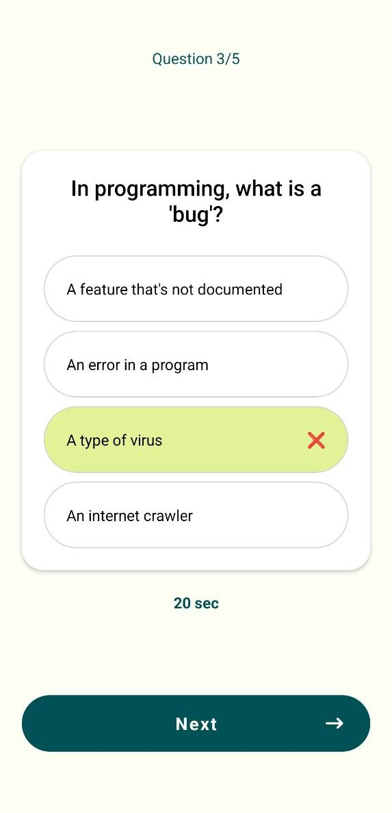

# Demo Quiz App

This project is a Quiz Application built using React Native. The application allows users to take quizzes on various topics and tracks their scores. Good for practicing your knowledge on React, React Native, Expo, State Management.

## Screenshots



# Conceps Used

- State Management with Context API
- React Native Styling
- Fundamentals of React Native

## Getting Started

To get started with the project, clone the repository and install the dependencies:

```bash
git clone <repository-url>
cd quiz
npm install
```

Run the application:

```bash
npm start
```

## Contributing

Contributions are welcome! Please open an issue or submit a pull request for any changes.

## License

This project is licensed under the MIT License.
